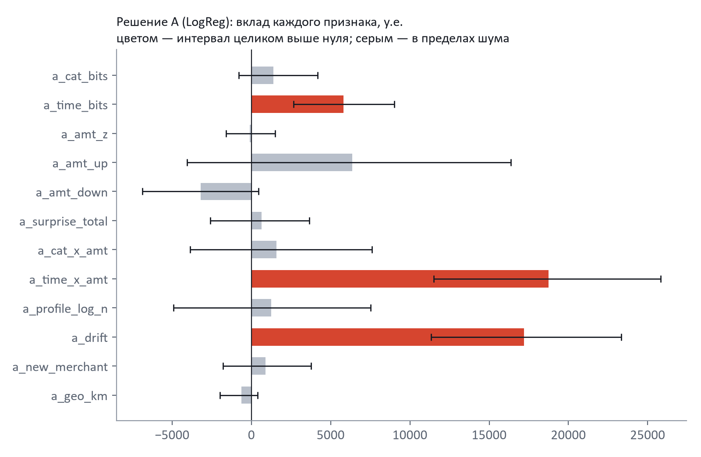
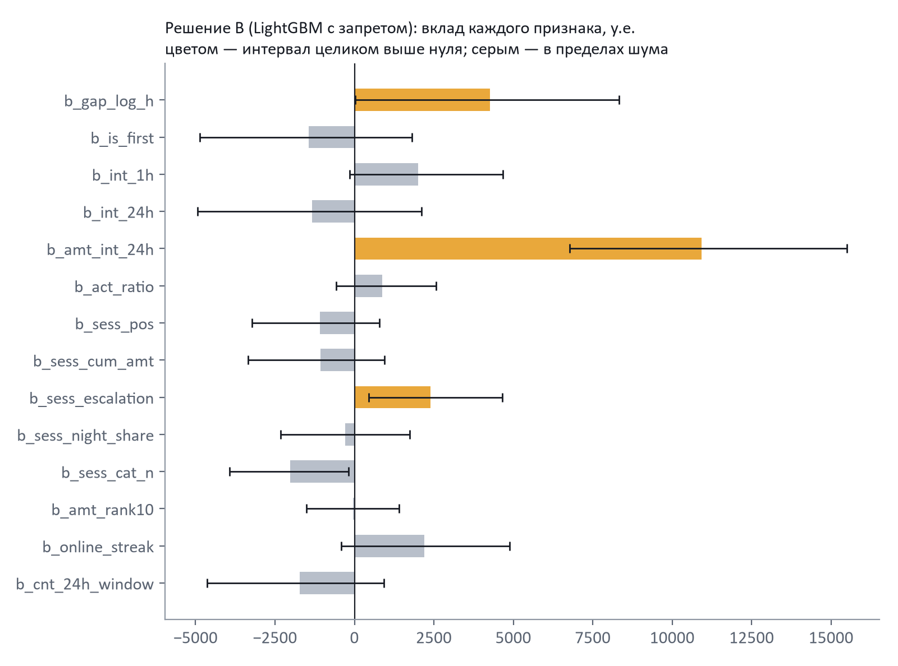
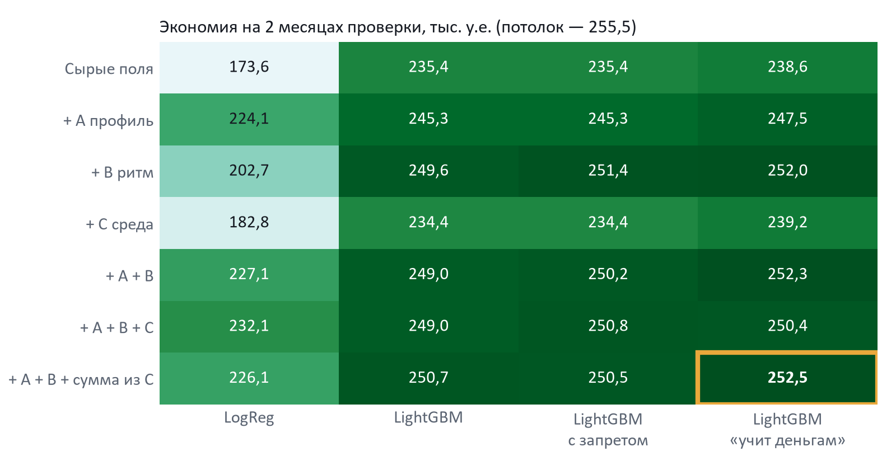
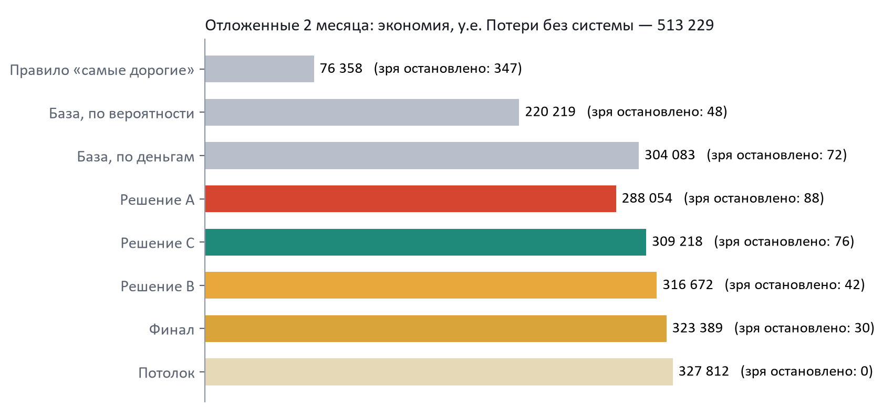
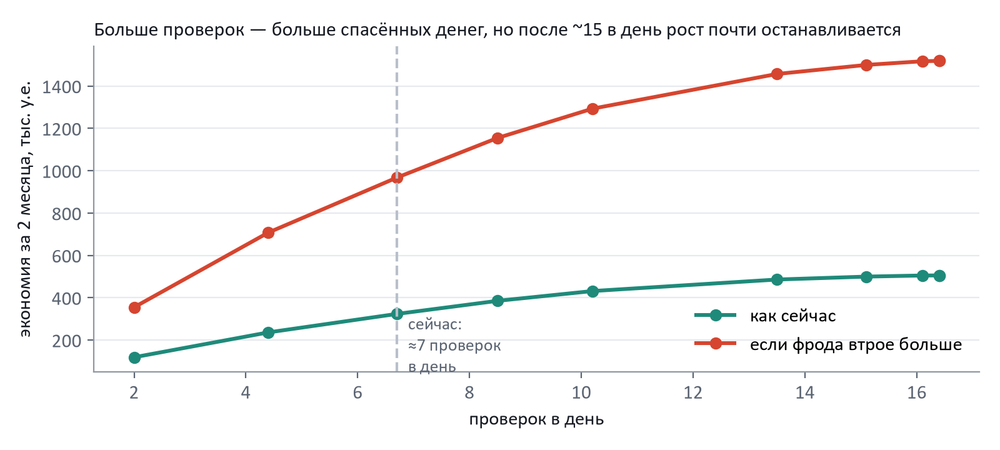

# Как читать этот документ

Здесь разобраны три решения команды (A, B, C), модели, сравнение и финальное решение. Все числа взяты из реальных запусков, исходные таблицы лежат в папке `reports/`. Если на защите спросят «откуда это число», ответ всегда один: из журнала `reports/experiments.csv`.

Периоды данных:

| Часть | Даты | Для чего |
|---|---|---|
| Обучение (train) | 01.01.2019 – 20.02.2020 | на этом модели учатся |
| Проверка идей (valid) | 21.02 – 21.04.2020 | на этом сравнивали признаки, модели и решения |
| Отложенная проверка (holdout) | 22.04 – 21.06.2020 | открыли один раз, в самом конце, для финала |

Если нет времени читать всё, достаточно трёх разделов: 1 (задача), 7 (лучшее решение) и 8 (сравнение).

# 1. Задача и главный инсайт

Банк получает поток операций по картам. Среди них есть мошеннические, но их мало: **0,58%**, примерно **14 операций в день**. Проверить подозрительную операцию может аналитик, но аналитиков мало: по условию они успевают только **0,3% операций — около 7 в день**.

Отсюда главное наблюдение. **Даже идеальная модель, которая заранее знает правду, не сможет отправить на проверку всё мошенничество.** Мы посчитали, сколько она спасла бы: на двух месяцах проверки — 255 485 у.е. из 414 356 возможных потерь, то есть **62%**. Это наш «потолок». Больше при таком числе аналитиков не спасти.

Поэтому вопрос задачи звучит не «насколько вероятно, что это мошенничество», а **«проверка каких семи операций сегодня спасёт больше всего денег»**.

Цифры заказчика, из которых считаются деньги:

| Событие | Стоимость |
|---|---|
| Проверка одной операции аналитиком | 3 у.е. |
| Проверили честную операцию: клиент ждёт, неприятно | ещё 25 у.е. (итого 28) |
| Пропустили мошенничество | сумма операции + 5 у.е. |

Главная метрика — **экономия**: насколько меньше банк теряет с нашей системой, чем без неё.

# 2. Как мы сравнивали решения (одинаковые правила для всех)

Чтобы три решения можно было честно сравнить, всё проверялось одним и тем же «судьёй»:

1. **Разбиение только по времени.** Учимся на прошлом, проверяем на будущем, как в жизни. Если бы мы перемешали операции случайно, признаки «по истории карты» подсмотрели бы соседние операции той же кражи и дали бы слишком красивый результат.
2. **Одна метрика — экономия в у.е. при лимите 0,3% в день.** Рядом всегда показываем потолок и простое правило «проверять самые дорогие операции».
3. **Признаки добавляли по одному.** После каждого записывали, сколько денег он добавил.
4. **Интервал вместо одного числа.** Два месяца — это около 780 мошеннических операций, и разница в 2–3 тыс. может оказаться случайностью. Поэтому для каждого признака мы считали диапазон, в котором, скорее всего, лежит его настоящий вклад (бутстрэп по дням, 90%). Если диапазон задевает ноль, это «в пределах шума», и мы не выдаём такой признак за успех.
5. **Тест на подглядывание в будущее.** Признак считается два раза: по данным до какой-то даты и по всему файлу. Для операций до этой даты значения обязаны совпасть. Тест проверен на заведомо плохих признаках, и он их ловит. Все 31 признак его прошли.

# 3. Решение A — «Так хозяин карты не платит»

## Идея простыми словами

Если картой пользуется чужой человек, у него другие привычки: он покупает в других категориях, в другое время и на другие суммы, чем хозяин. Поэтому каждая операция сравнивается **с прошлым именно этой карты**.

«Необычность» измеряется в **битах неожиданности**. Если клиент покупает в какой-то категории в половине случаев, это 1 бит. Если один раз из 128 — 7 бит. Биты разных «странностей» (категория, время, сумма) можно складывать и получать одну шкалу «насколько это не похоже на хозяина».

**Особенность, которой нет в обычных решениях: новая карта.** У карты без истории обычно получается пустое значение или деление на ноль. В решении A профиль новой карты равен профилю «среднего клиента» и с каждой операцией плавно становится своим (это называется сглаживанием). Поэтому модель работает с первой же операции, и пустых значений нет вообще.

## Признаки A

| Признак | Что означает | Какую операцию ловит | Вклад, у.е. (LogReg) |
|---|---|---|---|
| Неожиданность категории | как редко клиент покупает в этой категории | клиент два года платит за продукты — и вдруг «разное онлайн» | +1 378, в пределах шума |
| Неожиданность времени | как редко клиент платит в это время суток | «дневной» клиент платит в полночь | **+5 805**, устойчиво |
| Отклонение суммы в категории | во сколько раз сумма больше обычной для клиента в этой категории | 300 у.е. на продукты у того, кто тратит 40 | ≈0, в пределах шума |
| Крупная сумма в непривычное время | сочетание двух странностей | ночная покупка на 800 у.е. у «дневного» клиента | **+18 737**, устойчиво |
| Сдвиг трат за последние дни | последние дни клиент тратит крупнее обычного | карта вдруг тратит в 1,6 раза крупнее | **+17 200**, устойчиво |
| Остальные (сводная шкала, число операций в истории и др.) | вспомогательные | — | в пределах шума |

{width=100%}

## Модель A: логистическая регрессия

Это самая простая модель: каждый признак получает «вес», веса складываются, и сумма превращается в вероятность. Её легко объяснить: видно, какой признак сколько добавил.

**Зачем взяли:** проверить гипотезу «если признаки хорошие, простой модели хватит».

**Что получилось:** гипотеза **не подтвердилась**. На признаках A простая модель даёт 224 148 у.е., а более сложная (LightGBM) на тех же признаках — 245 302. Причина в том, что простая модель думает «больше сумма — больше риск» одинаково для всех категорий. А в данных мошенничество в «покупках онлайн» дорогое (в медиане около 1 000 у.е.), а в «топливе» дешёвое (около 11 у.е.). Такие сочетания простая модель видит только тогда, когда их специально подсказать, поэтому в A есть признак-сочетание «крупная сумма × непривычное время».

## Сильные и слабые стороны

- **Сильная:** лучше всех ловит **первую операцию кражи**, когда серии ещё нет: 12 082 у.е. против 10 938 у B.
- **Сильная:** работает на новой карте; из признаков получаются понятные причины для аналитика («сумма в 453 раза больше обычной»).
- **Слабая:** вор, который тратит «как хозяин» (те же категории, днём, обычные суммы), профилем не ловится. Его ловит решение B.
- **Результат:** на проверочных двух месяцах 224 148 у.е. (87,7% потолка), на отложенных — 288 054 у.е.

## Что в A не сработало

- **Расстояние до продавца** (от привычных мест клиента). У мошенничества и честных покупок медиана одинаковая, 78,2 км: в этих данных продавец ставится случайно рядом с домом.
- **Первая покупка у продавца.** У честных клиентов это 37% всех операций, поэтому сигнала нет.
- **«Нетипично маленькая сумма»** (проверка карты мелочью). Вклад отрицательный: первая мошенническая операция серии в медиане стоит 311 у.е.

# 4. Решение B — «Карту выкачивают»

## Идея простыми словами

В данных мошенничество идёт **сериями**. У одной карты в среднем около 10 мошеннических операций, все укладываются в двое суток, пауза между ними в медиане около часа. Решение B смотрит не на то, **что** покупают, а на **ритм**: как часто и сколько списывают.

Три особенности, которых нет в обычных решениях:

1. **Плавная память вместо окна «за 24 часа».** В обычном решении операция 23 часа назад считается, а 25 часов назад уже нет, и признак прыгает на границе. У нас каждая прошлая операция весит тем меньше, чем она старше: свежая — почти 1, суточной давности — заметно меньше. Резких скачков нет.
2. **Сравнение с нормой клиента.** «Пять операций в день» — норма для одного и тревога для другого. Поэтому считается «во сколько раз активнее обычного». У мошенничества медиана 1,46, у честных 1,09.
3. **Сессии атаки.** Поток карты режется на отрезки без перерыва дольше 3 часов. Внутри отрезка видно, какая это операция по счёту, сколько уже списано и растёт ли сумма.

## Признаки B

| Признак | Что означает | Вклад, у.е. |
|---|---|---|
| Сколько денег списано за последние сутки (плавная память) | главный признак B: у мошенничества медиана около 1 323 у.е., у честных около 188 | **+10 915**, устойчиво |
| Пауза после прошлой операции | при краже операции идут вплотную | **+4 263**, на грани |
| Рост суммы внутри серии | сначала меньше, потом больше | **+2 387**, устойчиво |
| Серия онлайн-покупок подряд | данные карты утекли в интернет | +2 206, на грани шума |
| Активность за час / сутки, «во сколько раз активнее обычного», номер в серии и др. | вспомогательные | в пределах шума |

{width=100%}

## Модель B: LightGBM с запретом

**LightGBM** — это много маленьких деревьев решений. Каждое дерево — набор вопросов «да/нет» («операция ночью?», «сумма больше 500?»). Каждое следующее дерево учится исправлять ошибки предыдущих. Такая модель сама находит сочетания вроде «ночь × онлайн × крупная сумма», которые простой модели нужно подсказывать.

**Запрет (ограничение монотонности).** Модели запрещено снижать риск, когда растёт активность. Без запрета модель могла бы случайно выучить странное правило «8 операций за час безопаснее, чем 6». С запретом она ведёт себя предсказуемо, и её легче объяснить заказчику.

**Цена запрета:** по деньгам ничего не стоило — 251 417 у.е. с запретом против 249 627 без него, разница в пределах шума.

## Сильные и слабые стороны

- **Сильная:** лучше всех ловит **продолжение серии**: 240 841 у.е. против 234 186 у A.
- **Сильная:** реже всех одиночных решений останавливает честных клиентов (35 за два месяца на проверке, 42 на отложенных).
- **Слабая:** первую операцию кражи, когда серии ещё нет, ловит хуже A.
- **Результат:** на проверке 251 417 у.е. (98,4% потолка), на отложенных — 316 672 у.е.

## Что в B не сработало

- **Классическое окно «операций за 24 часа»** поверх плавной памяти ничего не добавило (−1 722, шум). Это и есть типичный признак из решений на Kaggle.
- **Разнообразие категорий в серии** вредит: −2 023, весь интервал ниже нуля.
- **Порог сессии** 1, 3 или 6 часов почти не важен (248 695 / 249 069 / 250 664 у.е.), оставили 3 часа.

# 5. Решение C — «Что выгоднее проверить сегодня»

## Идея простыми словами

Решение принимается **по деньгам**, а не по вероятности. C сделала четыре вещи.

**1. Правило выбора операций — самый большой эффект проекта.** Для каждой операции считается, сколько денег в среднем спасёт её проверка:

> польза = вероятность × (сумма + 5) − 3 − (1 − вероятность) × 25

Каждый день аналитикам отправляются операции с наибольшей пользой, пока не кончится лимит, и только если польза больше нуля. Пример: покупка на 900 у.е. с вероятностью 30% — польза около 251 у.е. Покупка на 4 у.е. с вероятностью 90% — около 3 у.е. Проверяем первую.

На одной и той же базовой модели это правило дало **+69 370 у.е. (+42%)**: 166 067 → 235 437. А нашли мы его случайно. Признак из решения A улучшил распознавание (PR-AUC вырос с 0,48 до 0,71), но экономия упала на 43 тыс.: модель стала находить мелкое мошенничество и тратить на него проверки.

**2. Модель «учится деньгам».** При обучении пропущенный дорогой фрод весит «сумма + 5», честная операция — 28. Модель сильнее старается не пропустить дорогое. Эффект небольшой, но стабильный: +2–3 тыс. почти на всех наборах признаков.

**3. Калибровка.** Из-за весов модель завышает вероятности, а формула пользы требует честных. Поэтому после модели стоит подгонка (isotonic): «30%» должно значить «3 из 10». Проверка на отложенных данных: у операций с ненулевым скором предсказано в среднем 61% мошенничества, фактически 60%.

**4. Риск среды с задержкой меток.** Доля мошенничества по категории и времени суток, по сумме в категории, по возрасту и категории, по продавцу. Банк узнаёт о краже не сразу, а после жалобы клиента, поэтому используются только метки старше 30 дней.

## Что получилось

| Эксперимент | Результат |
|---|---|
| Выбор по пользе вместо вероятности (одна и та же модель) | **166 067 → 235 437 у.е. (+69 370)** |
| Обучение с весами по деньгам (на сырых полях) | +3 157 у.е., на грани шума |
| Риск среды для LightGBM | в пределах шума: дерево и так видит категорию и час |
| Риск среды для простой модели | **+9 248 у.е.** (173 562 → 182 810) |
| Задержка меток 30 дней против 1 дня | 239 249 против 238 901 — реализм ничего не стоит |
| Метки «того же дня» | это утечка: тест её поймал |
| Isolation Forest (обучение без меток) | 167 082 против 235 437 с метками — «необычное ≠ мошенническое» |
| Стресс-тест: фрода втрое больше | при лимите 0,3% пропуск 558 875 у.е. за 2 месяца, при 1% — 25 712 |

- **Результат:** на проверке 239 249 у.е. (93,6% потолка), на отложенных — 309 218 у.е.
- **Главный вклад C в финал** — не признаки, а правило выбора, веса по деньгам, калибровка и расчёт экономики. Из признаков C в финал вошёл один: «сумма дороже X% покупок в этой категории». Он работает с первой операции новой карты.

# 6. Модели: что это и почему такие

| Модель | Простыми словами | Где использовали | Итог |
|---|---|---|---|
| Логистическая регрессия | каждый признак даёт «вес», веса складываются | решение A | понятная, но проигрывает от 17 до 62 тыс.: не видит сочетаний «сумма × категория × время» |
| LightGBM | сотни маленьких деревьев вопросов «да/нет», каждое исправляет ошибки предыдущих | базовая модель, B, C, финал | лучший результат; сама находит сочетания, спокойно работает с пустыми значениями, быстрая |
| LightGBM с запретом | то же, но риск не может падать при росте активности | решение B | по деньгам как обычный, зато предсказуемее |
| LightGBM, «учится деньгам» | дорогой пропущенный фрод при обучении весит больше | решение C, финал | +2–3 тыс., стабильно |
| Isolation Forest | ищет «необычные» операции без меток | контроль в C | сильно хуже: 167 тыс. |
| Калибровка (isotonic) | подгонка, чтобы вероятность была честной | C, финал | предсказано 61%, фактически 60% |

**Что будет, если заменить модель на другую?** Мы проверили это напрямую: поменяли модели местами на всех наборах признаков.

{width=100%}

- **По строкам:** признаки A+B добавляют к сырым полям 13,6–14,8 тыс. у.е. на любом варианте LightGBM.
- **По столбцам:** варианты LightGBM на одних и тех же признаках различаются не больше чем на 3,3 тыс. Это шум.
- **Простая модель** отстаёт везде.

**Вывод:** работу делают признаки по истории карты и правило выбора по деньгам. Конкретный вариант модели-«дерева» почти не важен. Гиперпараметры мы не подбирали: так советует ТЗ, и таблица это подтверждает. Параметры LightGBM стандартные: до 2 000 деревьев, шаг 0,05, 31 лист, остановка, когда проверочный результат перестаёт расти (в финале остановилась на 560 деревьях).

**Дисбаланс классов.** Мошенничества 0,58%. Мы **не дублировали** редкие примеры и **не выбрасывали** частые (SMOTE, undersampling). Искусственные строки ломают признаки по истории карты и искажают вероятности, а честные вероятности нужны формуле пользы. Вместо этого — веса по деньгам и калибровка.

# 7. Лучшее решение — финал

## Что в него входит

| Часть | Откуда | Зачем |
|---|---|---|
| 10 сырых полей (сумма, категория, час, день недели, ночь, онлайн, возраст, пол, размер города) | база | основа |
| 9 признаков профиля клиента | решение A | ловит первую операцию кражи и «чужие привычки» |
| 12 признаков ритма операций | решение B | ловит серии и быстрое «выкачивание» |
| 1 признак «сумма дороже X% покупок категории» | решение C | работает с первой операции новой карты |
| LightGBM, «учится деньгам» + калибровка | решение C | честные вероятности с упором на дорогое |
| Выбор по пользе проверки в пределах 7 в день | решение C | самый большой эффект |

Итого 32 признака. Отвергнутые гипотезы и лишние контроли в финал не вошли (список — в разделе 9).

## Почему именно так, а не просто «лучшее число»

На проверочных данных финал набрал 252 522 у.е., **98,8% потолка**. Но ближайшие варианты отличаются от него на сотни у.е., а это шум. Поэтому решающим доводом было не число, а **разбор по сценариям**: что именно ловит каждое решение.

{width=100%}

- **Первая операция кражи:** A — 12 082 у.е., B — 10 938, финал — **12 319**.
- **Продолжение серии:** A — 234 186, B — 240 841, финал — **240 335** (почти как B).
- **Честных клиентов остановлено зря:** A — 56, B — 35, финал — **27** (у базовой модели 76).

Финал ловит **оба сценария** и реже всех обижает честных клиентов. Поэтому он лучше каждого решения по отдельности.

**Что проверили и не взяли:** запрет «снижать риск» из B. По деньгам разница в шуме (253 057 против 252 522), а честных остановок с ним больше (34 против 27). При равных деньгах выбрали меньше обиженных клиентов.

## Как финал обрабатывает одну операцию (реальный пример)

Операция 08.06.2020, 23:49, покупки в магазине, 1 215,89 у.е.

1. **Признаки.** За последние сутки с карты уже списано около 4 870 у.е.; это пятая операция подряд ночью; сумма дороже 99% покупок в категории.
2. **Вероятность** после калибровки — 100%.
3. **Польза проверки:** 1 × (1 215,89 + 5) − 3 − 0 × 25 = **1 217,89 у.е.** Одна из самых выгодных операций дня.
4. **Решение:** отправить аналитику.
5. **Карточка аналитику:** «За последние сутки по карте уже списано около 4 870 у.е.» · «Сумма дороже 99% покупок в категории „покупки в магазине“» · «Серия из 5 операций ночью».

Контрпример — честная покупка 27.04.2020, 23:13, покупки онлайн, 3 918,79 у.е. Вероятность мошенничества всего 1,9%, но польза проверки 0,019 × 3 923,79 − 3 − 0,981 × 25 ≈ **46,5 у.е.** больше нуля: проверка стоит 3, а пропуск такой суммы — почти 3 924. Поэтому система её проверяет. Это осознанное решение, а не ошибка.

## Результат на отложенных двух месяцах

{width=100%}

| Вариант | Экономия, у.е. | Доля потолка | Зря остановлено |
|---|---|---|---|
| Правило «проверять самые дорогие» | 76 358 | 23% | 347 |
| Базовая модель, по вероятности | 220 219 | 67% | 48 |
| Базовая модель, по деньгам | 304 083 | 93% | 72 |
| Решение A | 288 054 | 88% | 88 |
| Решение B | 316 672 | 97% | 42 |
| Решение C | 309 218 | 94% | 76 |
| **Финал** | **323 389** | **98,7%** | **30** |
| Потолок (идеальная модель) | 327 812 | 100% | 0 |

- Финал поймал 376 мошеннических операций, и **93%** того, что он отправляет аналитикам, действительно мошенничество.
- На проверочных данных было 98,8% потолка, на отложенных 98,7%. Значит, модель не подогнана под проверочный период.
- Решения A, B, C на отложенных данных посчитаны **уже после выбора финала**, только для отчёта. Порядок тот же, что и на проверке.

## Сколько нужно аналитиков

{width=100%}

Если мошенничества станет втрое больше, то при нынешних 7 проверках в день банк будет пропускать 558 875 у.е. за два месяца. При 10 проверках в день пропуск снизится до 232 918, при 15 — до 25 712. Больше 15–16 проверок в день почти ничего не добавляют.

## Работоспособность

- `python train.py` обучает модель, `python score.py --input … --output …` оценивает новые операции.
- 550 000 строк обрабатываются за **32 секунды** при 2 ГБ памяти (лимит — 10 минут и 8 ГБ).
- Не падает на новой карте, новом продавце, новой категории, файле из одной строки, двух операциях в одну секунду и битой дате (11 проверок из 11).
- Вероятности `score.py` совпадают с оценкой до 4·10⁻⁷: признаки при обучении и при работе считает один и тот же код.

## Слабые места финала (честно)

- Данные синтетические (генератор Sparkov): часть выводов, например что расстояние бесполезно, может не перенестись на настоящий банк.
- Сдаём ровно ту модель, которая прошла честную проверку. В эксплуатации её стоит переобучить на всех данных до июня 2020.
- `score.py` соблюдает лимит по дням входного файла. В настоящем потоке нужен суточный счётчик отправленных.
- Мошенники подстроятся. Признаки ритма обойти дороже всего (придётся красть медленно), но модель нужно регулярно переобучать и следить за долей подтверждённого мошенничества среди проверенных.

# 8. Сравнение трёх решений в одной таблице

| | A — профиль | B — ритм | C — деньги |
|---|---|---|---|
| Сценарий | чужой человек с другими привычками | серия быстрых операций после кражи | решение по деньгам при лимите |
| Модель | логистическая регрессия | LightGBM с запретом | LightGBM, «учится деньгам» |
| Главная находка | «крупная сумма в непривычное время», «сдвиг трат» | «сколько списано за сутки» | правило выбора по пользе проверки (+69 тыс.) |
| Проверка, у.е. | 224 148 | 251 417 | 239 249 |
| Отложенные, у.е. | 288 054 | 316 672 | 309 218 |
| Лучше всех ловит | первую операцию кражи | продолжение серии | дорогое мошенничество |
| Не подтвердилось | «простой модели хватит», расстояние | окно «24 часа», разнообразие категорий | риск среды для деревьев, обучение без меток |
| Что вошло в финал | 9 признаков | 12 признаков | правило выбора, веса, калибровка, 1 признак |

**Какое решение лучше?** По одиночке сильнее всех **B** (316 672 у.е. на отложенных данных). Но главный эффект проекта дало правило выбора из **C**: без него даже лучшие признаки теряют десятки тысяч. **A** слабее по деньгам, зато ловит то, что пропускает B, — первую операцию кражи. **Поэтому лучшее решение — их объединение**: 323 389 у.е., 98,7% от возможного, и меньше всего зря остановленных клиентов.

# 9. Отвергнутые идеи и почему это тоже результат

| Идея | Почему не взяли |
|---|---|
| Расстояние до продавца (самый популярный признак на Kaggle) | медианы у мошенничества и честных совпадают: 78,2 км |
| Проверка карты мелкой суммой | первая мошенническая операция серии — в медиане 311 у.е. |
| Первая покупка у продавца | у честных клиентов это 37% операций |
| Разнообразие категорий в серии | вредит: интервал ниже нуля |
| Окно «операций за 24 часа» | поверх плавной памяти ничего не даёт |
| Риск категории, суммы, возраста, продавца (для деревьев) | дерево и так видит категорию и час; полезно только простой модели |
| Обучение без меток | 167 тыс. против 235 тыс. |
| «Простой модели хватит» | отставание от 17 до 62 тыс. |

**Как мы поняли, что дело в идее, а не в проверке.** У всех признаков одна линейка, одна политика и один период. Для отвергнутых признаков мы смотрели на сами данные (распределения совпадают), а не только на итоговое число. Тест на утечку проверен на заведомо плохих признаках.

# 10. Словарик

| Слово | Как сказать просто |
|---|---|
| Признак | одно число, которое мы считаем для операции («сколько списано за сутки») |
| Потолок | сколько спасла бы модель, которая заранее знает правду, при том же числе аналитиков |
| Интервал 90% | диапазон, где, скорее всего, лежит настоящий эффект; если задевает ноль — может быть случайностью |
| Утечка / подглядывание в будущее | признак использует то, чего в момент операции ещё не было |
| Калибровка | подгонка, чтобы «30%» и правда значило «3 из 10» |
| Бит неожиданности | 1 бит — «так бывает в половине случаев», 7 бит — «1 раз из 128» |
| Плавная память | прошлая операция весит тем меньше, чем она старше, без резкой границы |
| Задержка меток | банк узнаёт о краже после жалобы клиента; используем только метки старше 30 дней |
| PR-AUC | насколько хорошо модель ставит мошенничество выше честных операций, без учёта денег |
